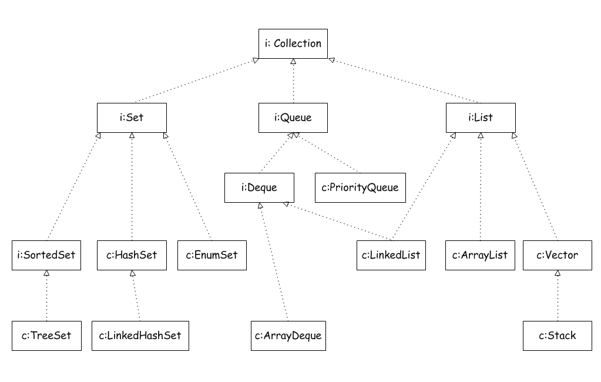
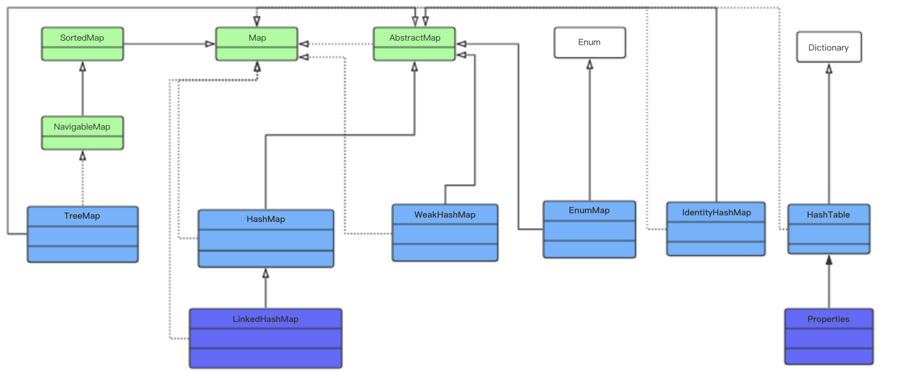
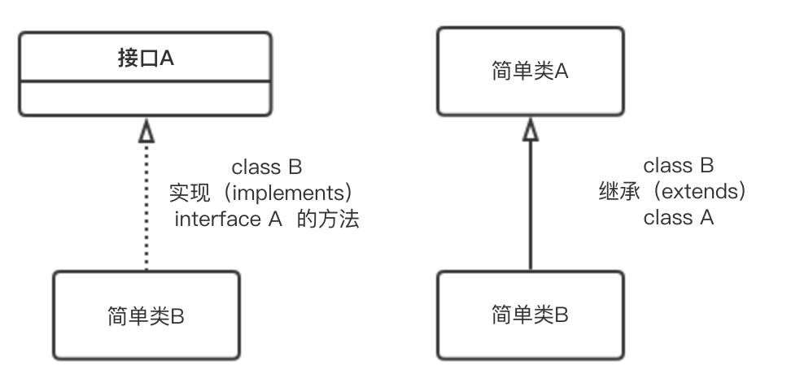

<a id = "jump">[返回首页](/README.md)</a>

<!-- TOC -->
- [Collection_Map](#collectionmap)
- [是否允许空值](#%E6%98%AF%E5%90%A6%E5%85%81%E8%AE%B8%E7%A9%BA%E5%80%BC)
- [是否有序](#%E6%98%AF%E5%90%A6%E6%9C%89%E5%BA%8F)
- [ArrayList和LinkedList区别](#arraylist%E5%92%8Clinkedlist%E5%8C%BA%E5%88%AB)
  - [时间复杂度](#%E6%97%B6%E9%97%B4%E5%A4%8D%E6%9D%82%E5%BA%A6)
- [HashMap](#hashmap)
- [ConcurrentHashMap](#concurrenthashmap)
- [ArrayList](#arraylist)
- [LinkedList](#linkedlist)
- [Vector](#vector)
- [TreeMap](#treemap)
- [Hashtable](#hashtable)
- [HashSet](#hashset)
- [LinkedHashMap](#linkedhashmap)
- [LinkedHashSet](#linkedhashset)
- [TreeSet](#treeset)
- [红黑树](#%E7%BA%A2%E9%BB%91%E6%A0%91)
  - [红黑树的特性](#%E7%BA%A2%E9%BB%91%E6%A0%91%E7%9A%84%E7%89%B9%E6%80%A7)
  - [数据结构](#%E6%95%B0%E6%8D%AE%E7%BB%93%E6%9E%84)
  - [红黑树的三个基本操作](#%E7%BA%A2%E9%BB%91%E6%A0%91%E7%9A%84%E4%B8%89%E4%B8%AA%E5%9F%BA%E6%9C%AC%E6%93%8D%E4%BD%9C)

# Collection_Map

* 集合类图：





* UML图形的说明(框和箭头含义)



1. List必须按照插入的顺序保存元素，允许有重复的元素
2. Set集合，不能有重复元素，允许有空值，但只能有一个
3. Queue队列，先进先出（First In First Out，FIFO）的数据结构
4. Map键值对，键不能重复，值可以重复

---

# 是否允许空值

* **List** 集合可以存储多个null；
* **Set**集合也可以存储null，但只能存储一个；
* **HashMap**可以存储null键值对，键和值都可以是null，但如果添加的键值对的键相同，则后面添加的键值对会覆盖前面的键值对，即之后存储后添加的键值对；
* **Hashtable**不能添加null，抛空指针

[toTop](#jump)

# 是否有序


重复问题：除了set不可重复，其余均可；map的KEY也不可，value可以。

有序问题：除了list和tree有序，其余均无序。

[toTop](#jump)

# ArrayList和LinkedList区别

1) ArrayList是实现了基于动态数组的数据结构，LinkedList基于链表的数据结构。  
2) 对于随机访问get和set，ArrayList优于LinkedList，因为LinkedList要移动指针。(<font color='red'>基于程序局部性原理，缓存的概念，数组的遍历也是快于链表</font>)
3) 对于新增和删除操作add和remove，LinedList比较占优势，因为ArrayList要移动数据。

## 时间复杂度

**ArrayList** 是线性表（数组）
**get()** 直接读取第几个下标，复杂度 O(1)
**add(E)** 添加元素，直接在后面添加，复杂度O（1）
**add(index, E)** 添加元素，在第几个元素后面插入，后面的元素需要向后移动，复杂度O（n）
**remove()** 删除元素，后面的元素需要逐个移动，复杂度O（n）

**LinkedList** 是链表的操作
**get()** 获取第几个元素，依次遍历，复杂度O(n)
**add(E)** 添加到末尾，复杂度O(1)
**add(index, E)** 添加第几个元素后，需要先查找到第几个元素，直接指针指向操作，复杂度O(n)
**remove()** 删除元素，直接指针指向操作，复杂度O(1)

[toTop](#jump)

# HashMap

1) HashMap是基于哈希表的Map接口的非同步实现，允许使用null值和null键，但不保证映射的顺序。
2) 底层使用数组实现，数组中每一项是个单向链表，即数组和链表的结合体；当链表长度大于一定阈值时，链表转换为红黑树，这样减少链表查询时间。
3) HashMap在底层将key-value当成一个整体进行处理，这个整体就是一个Node对象。HashMap底层采用一个Node[]数组来保存所有的key-value对，当需要存储一个Node对象时，会根据key的hash算法来决定其在数组中的存储位置，在根据equals方法决定其在该数组位置上的链表中的存储位置；当需要取出一个Node时，也会根据key的hash算法找到其在数组中的存储位置，再根据equals方法从该位置上的链表中取出该Node。
4) HashMap进行数组扩容需要重新计算扩容后每个元素在数组中的位置，很耗性能
5) 采用了Fail-Fast机制，通过一个modCount值记录修改次数，对HashMap内容的修改都将增加这个值。迭代器初始化过程中会将这个值赋给迭代器的expectedModCount，在迭代过程中，判断modCount跟expectedModCount是否相等，如果不相等就表示已经有其他线程修改了Map，马上抛出异常

参考1 : [深入Java集合学习系列：HashMap的实现原理](http://zhangshixi.iteye.com/blog/672697)

参考2 : [JDK1.8 HashMap源码分析](https://blog.csdn.net/lizhongkaide/article/details/50595719)

参考3 :[Java 8系列之重新认识HashMap](https://tech.meituan.com/java-hashmap.html)

[toTop](#jump)

# ConcurrentHashMap

1) ConcurrentHashMap允许多个修改操作并发进行，其关键在于使用了锁分离技术。
2) 它使用了多个锁来控制对hash表的不同段进行的修改，每个段其实就是一个小的hashtable，它们有自己的锁。只要多个并发发生在不同的段上，它们就可以并发进行。
3) ConcurrentHashMap在底层将key-value当成一个整体进行处理，这个整体就是一个Entry对象。Hashtable底层采用一个Entry[]数组来保存所有的key-value对，当需要存储一个Entry对象时，会根据key的hash算法来决定其在数组中的存储位置，在根据equals方法决定其在该数组位置上的链表中的存储位置；当需要取出一个Entry时，也会根据key的hash算法找到其在数组中的存储位置，再根据equals方法从该位置上的链表中取出该Entry。
4) 与HashMap不同的是，ConcurrentHashMap使用多个子Hash表，也就是段(Segment)
5) ConcurrentHashMap完全允许多个读操作并发进行，读操作并不需要加锁。如果使用传统的技术，如HashMap中的实现，如果允许可以在hash链的中间添加或删除元素，读操作不加锁将得到不一致的数据。ConcurrentHashMap实现技术是保证HashEntry几乎是不可变的。

参考1 : [深入Java集合学习系列：Hashtable的实现原理](https://blog.csdn.net/zheng0518/article/details/42199477)

参考2 : [谈谈ConcurrentHashMap1.7和1.8的不同实现](http://www.importnew.com/23610.html)

[toTop](#jump)

# ArrayList

1) ArrayList是List接口的可变数组非同步实现，并允许包括null在内的所有元素。
2) 底层使用数组实现
3) 该集合是可变长度数组，数组扩容时，会将老数组中的元素重新拷贝一份到新的数组中，每次数组容量增长大约是其容量的1.5倍，这种操作的代价很高。
4) 采用了Fail-Fast机制，面对并发的修改时，迭代器很快就会完全失败，而不是冒着在将来某个不确定时间发生任意不确定行为的风险
5) remove方法会让下标到数组末尾的元素向前移动一个单位，并把最后一位的值置空，方便GC

参考1 : [深入Java集合学习系列：ArrayList的实现原理](http://zhangshixi.iteye.com/blog/674856)

参考2 : [JDK1.8源码分析之ArrayList](https://www.cnblogs.com/leesf456/p/5308358.html)

[toTop](#jump)

# LinkedList

1) LinkedList是List接口的双向链表非同步实现，并允许包括null在内的所有元素。
2) 底层的数据结构是基于双向链表的，该数据结构我们称为节点
3) 双向链表节点对应的类Node的实例，Node中包含成员变量：prev，next，item。其中，prev是该节点的上一个节点，next是该节点的下一个节点，item是该节点所包含的值。
4) 它的查找是分两半查找，先判断index是在链表的哪一半，然后再去对应区域查找，这样最多只要遍历链表的一半节点即可找到

参考1 : [Java集合---LinkedList源码解析](http://www.cnblogs.com/ITtangtang/p/3948610.html)

参考2 : [JDK1.8源码分析之LinkedList](https://www.cnblogs.com/leesf456/p/5308843.html)

[toTop](#jump)

# Vector

1. 类似ArrayList，但是Vector中的操作是线程安全的(synchronized)。

参考1 : [Vector源码解析](../code/vector.md)

[toTop](#jump)

# TreeMap

1. TreeMap 是一个有序的key-value集合，它是通过红黑树实现的。
2. TreeMap 继承于AbstractMap，所以它是一个Map，即一个key-value集合。
3. TreeMap 实现了NavigableMap接口，意味着它支持一系列的导航方法。比如返回有序的key集合。
4. TreeMap 实现了Cloneable接口，意味着它能被克隆。
5. TreeMap 实现了java.io.Serializable接口，意味着它支持序列化。

[toTop](#jump)

# Hashtable

1) Hashtable是基于哈希表的Map接口的同步实现，不允许使用null值和null键
2) 底层使用数组实现，数组中每一项是个单链表，即数组和链表的结合体
3) Hashtable在底层将key-value当成一个整体进行处理，这个整体就是一个Entry对象。Hashtable底层采用一个Entry[]数组来保存所有的key-value对，当需要存储一个Entry对象时，会根据key的hash算法来决定其在数组中的存储位置，在根据equals方法决定其在该数组位置上的链表中的存储位置；当需要取出一个Entry时，也会根据key的hash算法找到其在数组中的存储位置，再根据equals方法从该位置上的链表中取出该Entry。
4) synchronized是针对整张Hash表的，即每次锁住整张表让线程独占

参考：[深入Java集合学习系列：Hashtable的实现原理](https://blog.csdn.net/zheng0518/article/details/42199477)  

[toTop](#jump)

# HashSet

1) HashSet由哈希表(实际上是一个HashMap实例)支持，不保证set的迭代顺序，并允许使用null元素。
2) 基于HashMap实现，API也是对HashMap的行为进行了封装，可参考HashMap
3) **所有放入HashSet中的集合元素实际上由HashMap的key来保存，而HashMap的value则存储了一个PRESENT，它是一个静态的Object对象。** 根据HashMap的一个特性: 将一个key-value对放入HashMap中时，首先根据key的hashCode()返回值决定该Entry的存储位置，如果两个key的hash值相同，那么它们的存储位置相同。如果这个两个key的equalus比较返回true。那么新添加的Entry的value会覆盖原来的Entry的value，key不会覆盖。**因此,如果向HashSet中添加一个已经存在的元素，新添加的集合元素不会覆盖原来已有的集合元素。**

参考： [深入Java集合学习系列：HashSet的实现原理](http://zhangshixi.iteye.com/blog/673143)

参考2：[深入源码分析HashSet](https://blog.csdn.net/canot/article/details/51240251)

[toTop](#jump)

# LinkedHashMap

1) LinkedHashMap继承于HashMap，底层使用哈希表和双向链表来保存所有元素，并且它是非同步的，允许使用null值和null键。
2) 基本操作与父类HashMap相似，通过重写HashMap相关方法，重新定义了数组中保存的元素Entry，来实现自己的链接列表特性。该Entry除了保存当前对象的引用外，还保存了其上一个元素before和下一个元素after的引用，从而构成了双向链接列表。

参考：[深入Java集合学习系列：LinkedHashMap的实现原理](http://zhangshixi.iteye.com/blog/673789)

[toTop](#jump)

# LinkedHashSet

1) 对于LinkedHashSet而言，它继承与HashSet、又基于LinkedHashMap来实现的。LinkedHashSet底层使用LinkedHashMap来保存所有元素，它继承与HashSet，其所有的方法操作上又与HashSet相同。

参考：[深入Java集合学习系列：LinkedHashMap的实现原理](http://zhangshixi.iteye.com/blog/673789)

[toTop](#jump)

# TreeSet

[toTop](#jump)

# 红黑树

## 红黑树的特性

1) 每个节点或者是黑色，或者是红色。
2) 根节点是黑色。
3) 每个叶子节点是黑色。(注意：这里叶子节点，是指为空的叶子节点)
4) 如果一个节点是红色的，则它的子节点必须是黑色的。
5) 从一个节点到该节点的子孙节点的所有路径上包含相同数目的黑节点。


## 数据结构

```java
private static final boolean RED = true;
private static final boolean BLACK = false;
private Node root;//二叉查找树的根节点

//结点数据结构
private class Node{
    private Key key;//键
    private Value value;//值
    private Node left, right;//指向子树的链接:左子树和右子树.
    private int N;//以该节点为根的子树中的结点总数
    boolean color;//由其父结点指向它的链接的颜色也就是结点颜色.

    public Node(Key key, Value value, int N, boolean color) {
        this.key = key;
        this.value = value;
        this.N = N;
        this.color = color;
    }
}

/**
 * 获取整个二叉查找树的大小
 * @return
 */
public int size(){
    return size(root);
}
/**
 * 获取某一个结点为根结点的二叉查找树的大小
 * @param x
 * @return
 */
private int size(Node x){
    if(x == null){
        return 0;
    } else {
        return x.N;
    }
}
private boolean isRed(Node x){
    if(x == null){
        return false;
    }
    return x.color == RED;
}
```

## 红黑树的三个基本操作

* 左旋

```java
/**
 * 左旋转
 * @param h
 * @return
 */
private Node rotateLeft(Node h){
    Node x = h.right;
    //把x的左结点赋值给h的右结点
    h.right = x.left;
    //把h赋值给x的左结点
    x.left = h;
    //
    x.color = h.color;
    h.color = RED;
    x.N = h.N;
    h.N = 1+ size(h.left) + size(h.right);

    return x;
}
```

* 右旋

```java
/**
 * 右旋转
 * @param h
 * @return
 */
private Node rotateRight(Node h){
    Node x = h.left;
    h.left = x.right;
    x.right = h;

    x.color = h.color;
    h.color = RED;
    x.N = h.N;
    h.N = 1+ size(h.left) + size(h.right);
    return x;
}
```

* 颜色反转

```java
/**
 * 颜色转换
 * @param h
 */
private void flipColors(Node h){
    h.color = RED;//父结点颜色变红
    h.left.color = BLACK;//子结点颜色变黑
    h.right.color = BLACK;//子结点颜色变黑
}
```

参考 1. [最容易懂得红黑树](https://blog.csdn.net/sun_tttt/article/details/65445754)

参考 2. [红黑树(五)之 Java的实现](https://www.cnblogs.com/skywang12345/p/3624343.html)

[toTop](#jump)

---
